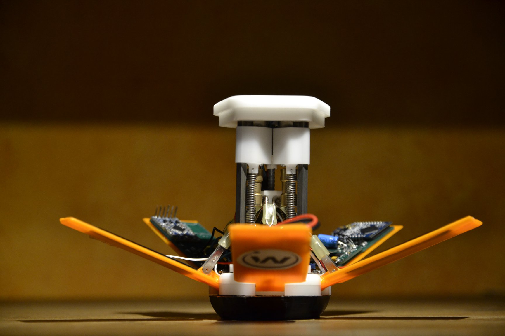

# White Noise
[White Noise](https://www.facebook.com/WhiteNoiseGRE/) is a space-engineering team from the National Technical University of Athens and currently consists of 6 members ( in alphabetical order ) :

 - Dimitris Bralios
 - Chariton Charitonidis
 - Iasonas Nikolaou
 - Spyros Pavlatos
 - George Rapakoulias
 - Miltiadis Stouras

Our team won 1st prize in the [CanSat in Greece 2018](https://cansat.gr/) competition.

# DrillSat

This repository hosts the electrical circuits, mechanical drawings and software of our CanSat. Our goal was to develop a CanSat that can help in exploring new planets, as a part of our idea to use CubeSats in space exploration. Specifically, our CanSat, after a successful landing with the parachute, is able to use its [leg mechanism](https://www.youtube.com/watch?v=kTSUgSXn8OM) and rise into a position from which it can dig its drills to the ground and measure the soil's moisture with a sensor we developed.
You can find our ground station [here](https://github.com/MStou/CanSat2018-Ground-Station).

Our team, after facing many difficulties developing the prototype, decided to be fully open source and released all of our work to make sure that future teams will not have to "re-invent the wheel".
